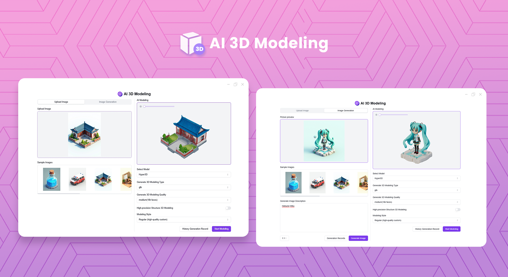
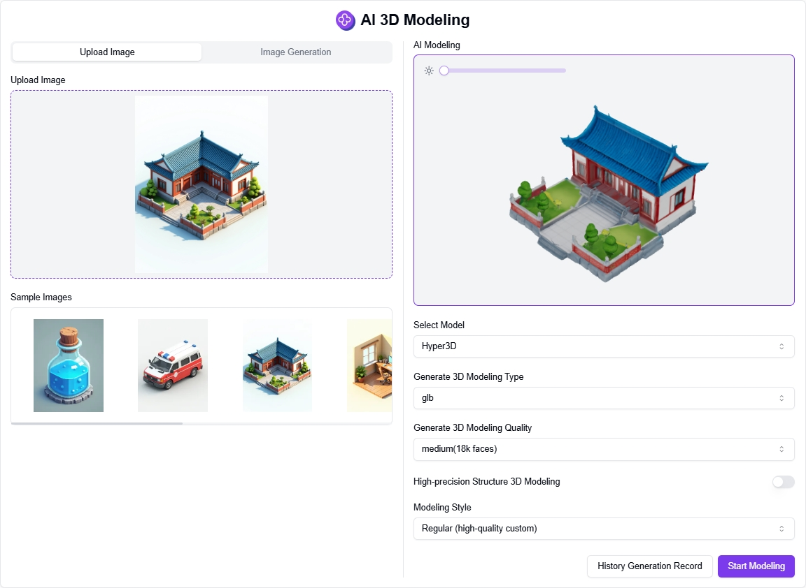

# <p align="center"> 🎨 AI 3D Modeling 🚀✨</p>

<p align="center">AI 3D Modeling can convert images into 3D models using AI, either from locally uploaded images or images generated based on user text input.</p>

<p align="center"><a href="https://302.ai/en/tools/3d/" target="blank"></a></p >

<p align="center"><a href="README_zh.md">中文</a> | <a href="README.md">English</a> | <a href="README_ja.md">日本語</a></p>



This is the open-source version of the [AI 3D Modeling](https://302.ai/en/tools/3d/) from [302.AI](https://302.ai/en/). You can directly log in to 302.AI to use the online version with zero code and zero background, or modify and deploy it yourself according to your requirements.


## Interface Preview
You can generate 3D models by uploading local images.


You can generate 3D models from AI-generated images based on text descriptions, with support for multi-angle preview and 3D model download.
        


## Project Features
### 📸 Image Upload
Support local image upload or AI image generation from text descriptions.
### 🎨 3D Model Generation
Convert 2D images into high-quality 3D models using advanced AI technology.
### 🔄 Multi-angle Preview
Support 360-degree rotation preview of generated 3D models to ensure model quality.
### 🌓 Dark Mode
It supports dark mode to protect your eyes.
### 🌍 Multi-language Support
- Chinese Interface
- English Interface
- Japanese Interface

## 🚩 Future Update Plans
- [ ] Support for more 3D model formats
- [ ] Add material and texture support


## 🛠️ Tech Stack

- **Framework**: Next.js 14
- **Language**: TypeScript
- **Styling**: TailwindCSS
- **UI Components**: Radix UI
- **State Management**: Jotai
- **Form Handling**: React Hook Form
- **HTTP Client**: ky
- **i18n**: next-intl
- **Theming**: next-themes
- **Code Standards**: ESLint, Prettier
- **Commit Standards**: Husky, Commitlint

## Development & Deployment
1. Clone the project
```bash
git clone https://github.com/302ai/302_ai_3d_modeling
cd 302_ai_3d_modeling
```

2. Install dependencies
```bash
pnpm install
```

3. Configure environment
```bash
cp .env.example .env.local
```
Modify the environment variables in `.env.local` as needed.

4. Start development server
```bash
pnpm dev
```

5. Build for production
```bash
pnpm build
pnpm start
```

## ✨ About 302.AI ✨
[302.AI](https://302.ai/en/) is an enterprise-oriented AI application platform that offers pay-as-you-go services, ready-to-use solutions, and an open-source ecosystem.✨
1. 🧠 Comprehensive AI capabilities: Incorporates the latest in language, image, audio, and video models from leading AI brands.
2. 🚀 Advanced application development: We build genuine AI products, not just simple chatbots.
3. 💰 No monthly fees: All features are pay-per-use, fully accessible, ensuring low entry barriers with high potential.
4. 🛠 Powerful admin dashboard: Designed for teams and SMEs - managed by one, used by many.
5. 🔗 API access for all AI features: All tools are open-source and customizable (in progress).
6. 💡 Powerful development team: Launching 2-3 new applications weekly with daily product updates. Interested developers are welcome to contact us.
